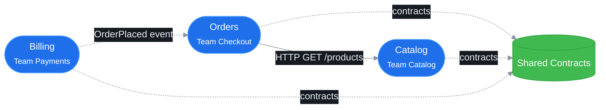

# Acme Commerce Platform — architecture landscape

> Generated by `bin/compile-architecture.php` on 2026-07-02 22:58. Do not edit by hand —
> change the services or the platform manifest and recompile.

## System landscape

Solid = synchronous call · dashed = asynchronous/event or shared library.

## Services

| Service | Owner | Namespace | Layers present | Docs |
|---|---|---|---|---|
| Shared Contracts | — | `Acme\Contracts` | Shared (1) | [ARCHITECTURE.md](../../contracts/docs/architecture/ARCHITECTURE.md) |
| Orders | Team Checkout | `Acme\Orders` | Domain (1), Application (1), Infrastructure (1), Presentation (1) | [ARCHITECTURE.md](../../orders-service/docs/architecture/ARCHITECTURE.md) |
| Catalog | Team Catalog | `Acme\Catalog` | Domain (1), Application (1), Infrastructure (1) | [ARCHITECTURE.md](../../catalog-service/docs/architecture/ARCHITECTURE.md) |
| Billing | Team Payments | `Acme\Billing` | Domain (1), Application (1), Infrastructure (1), Presentation (1) | [ARCHITECTURE.md](../../billing-service/docs/architecture/ARCHITECTURE.md) |

## Service summaries

### Shared Contracts

Versioned cross-service contracts (DTOs, event schemas).

Full documentation: [../../contracts/docs/architecture/ARCHITECTURE.md](../../contracts/docs/architecture/ARCHITECTURE.md)

### Orders

Handles the shopping cart and order placement lifecycle.

Full documentation: [../../orders-service/docs/architecture/ARCHITECTURE.md](../../orders-service/docs/architecture/ARCHITECTURE.md)

### Catalog

Owns the product catalog and pricing read models.

Full documentation: [../../catalog-service/docs/architecture/ARCHITECTURE.md](../../catalog-service/docs/architecture/ARCHITECTURE.md)

### Billing

Charges customers and reconciles payments against placed orders.

Full documentation: [../../billing-service/docs/architecture/ARCHITECTURE.md](../../billing-service/docs/architecture/ARCHITECTURE.md)

