# GitHub Release Notification Platform — architecture landscape

> Generated by `bin/compile-architecture.php` on 2026-07-04 14:44. Do not edit by hand —
> change the services or the platform manifest and recompile.

## System landscape

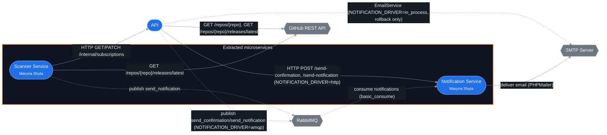

Solid = synchronous call · dashed = asynchronous/event or shared library. Grey hexagons
are external systems the platform depends on but doesn't own (no source/docs to link to).

## Services

| Service | Owner | Namespace | Layers present | Docs |
|---|---|---|---|---|
| API | — | `App` | — | [ARCHITECTURE.md](architecture/domain-map.md) |
| Notification Service | Maryna Shyta | `NotificationService` | — | [ARCHITECTURE.md](../notification-service/docs/architecture/ARCHITECTURE.md) |
| Scanner Service | Maryna Shyta | `ScannerService` | Infrastructure (2) | [ARCHITECTURE.md](../scanner-service/docs/architecture/ARCHITECTURE.md) |

## Service summaries

### API

The API is the release-notification monolith: it owns subscription management end to end
(subscribe, confirm, unsubscribe, list) behind a saga that keeps the `subscriptions` table and
the confirmation email in sync without a distributed transaction, validates and snapshots
GitHub repository state via its own GitHub client, and exposes an internal HTTP contract that
Scanner Service reads and writes through instead of touching the database directly. Two
extracted services depend on it — Scanner Service calls its internal subscriptions endpoints,
and both the API and Scanner Service publish to Notification Service (directly over HTTP/AMQP,
or via the shared RabbitMQ queue). The one write path with a real failure mode — subscribe,
which must create a row *and* get an email out — is modelled explicitly as a **saga**
(`SubscribeSagaOrchestrator`) rather than hidden inside a single service method, so a mailer
failure compensates (deletes the row) instead of leaving an orphaned, unconfirmable
subscription.

#### System Context (C4 L1)

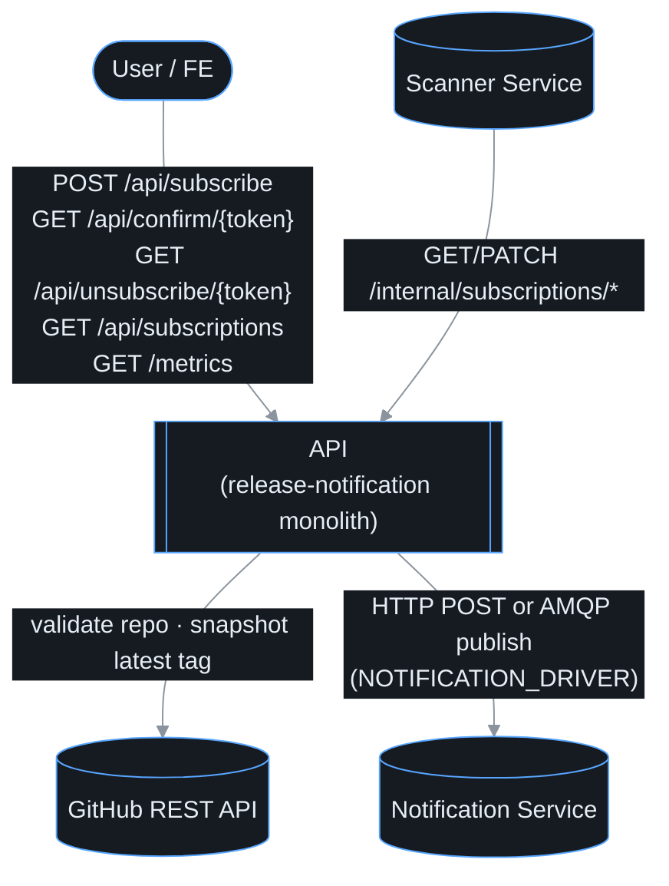

#### Containers (C4 L2)

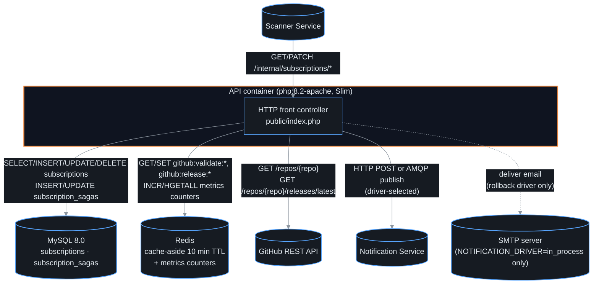

The API runs as a single container; there is no background process left in it — Scanner's
copy of the polling loop (`src/Modules/Scanner/`, root `bin/scanner.php`) is dead code, not
wired into `docker-compose.yml` (see § 7).

#### Components (C4 L3)

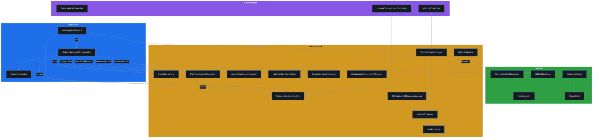

- **Presentation** — HTTP controllers: `SubscriptionController::subscribe()/confirm()/unsubscribe()/getSubscriptions()`,
  `InternalSubscriptionController::confirmed()/updateLastSeenTag()` (the only surface Scanner
  Service is allowed to call, behind `ApiKeyMiddleware` — database-per-service), and
  `MetricsController::metrics()`.
- **Application** — `SubscriptionService` is the façade the controller calls
  (`subscribe()/confirm()/unsubscribe()/getSubscriptions()`); it delegates the one multi-step
  write (subscribe) to `SubscribeSagaOrchestrator::run()`/`compensate()` and does everything
  single-step itself. `TokenGenerator::generate()` mints the confirm/unsubscribe tokens.
- **Domain** — `SubscribeSaga` is an immutable state machine (`SagaState`); each `withXxx()`
  call (`withSubscriptionCreated()`, `withCompleted()`, `withCompensating()`,
  `withCompensated()`) returns a new saga snapshot, persisted after every transition so the
  saga's progress survives a crash mid-run. `GitHubRelease::fromApiResponse()` and
  `GitHubApiCallRecorded` (endpoint, cacheHit) round out the domain layer.
- **Infrastructure** — `SubscriptionRepository` implements both the write-side and the
  Scanner-facing read/update ports (`existsByEmailAndRepo()`, `create()`, `confirm()`,
  `delete()`, `deleteByEmailAndRepo()`, `findAllConfirmed()`, `countActive()`);
  `ConfirmationMailerInterface` has three adapters selected by `NOTIFICATION_DRIVER`
  (`AmqpConfirmationMailer`, `HttpConfirmationMailer`, or the in-process `EmailService`
  fallback); GitHub API-call telemetry is decoupled from `GitHubService` via a domain event
  (`GitHubApiCallRecorded` → `GitHubApiCallMetricsListener`) rather than a direct call into
  Observability; `PdoTransactionManager::transactional()` wraps the saga's compensating delete.

Full documentation: [architecture/domain-map.md](architecture/domain-map.md)

### Notification Service

Notification Service is a standalone PHP microservice, extracted from the release-notification
monolith via the Strangler Fig pattern, that owns email delivery: confirmation emails and
release-notification emails. It exposes two independently deployable entry points built from
the same image — an HTTP API (`public/index.php`, Slim) for the synchronous path
(`NOTIFICATION_DRIVER=http`) and a CLI AMQP consumer (`bin/consumer.php`) for the asynchronous
path (`NOTIFICATION_DRIVER=amqp`), both driving the same underlying capability. The service
owns no database and no state; its only outward dependency is an SMTP server. The
architecture is **ports & adapters organised per feature**, not top-level layer folders: the
single `MailerInterface` port is the one thing both delivery mechanisms depend on, and
`Mailer` (PHPMailer-backed) is its only adapter. Dependencies still point inward — both
delivery paths reach the mailer only through the port, and the AMQP path's reliability
plumbing (retry, dead-lettering) is kept out of the HTTP path entirely.

#### System Context (C4 L1)

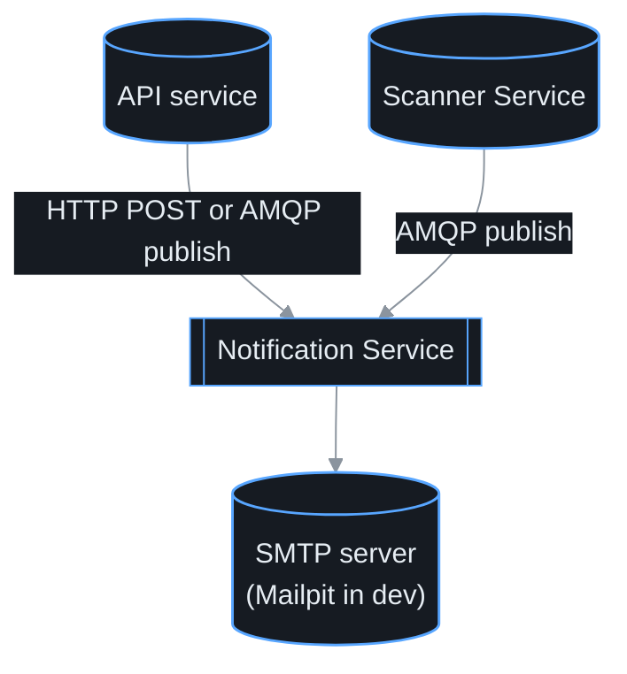

#### Containers (C4 L2)

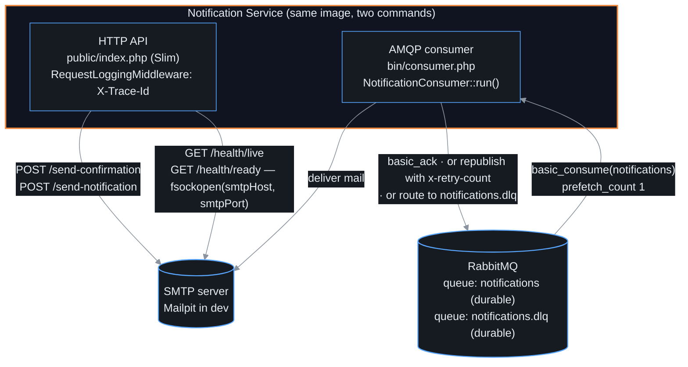

`notification` and `notification-consumer` are two containers built from the same image
(`docker-compose.yml`) running different commands — the HTTP process never touches RabbitMQ,
and the consumer process never binds a port.

#### Components (C4 L3)

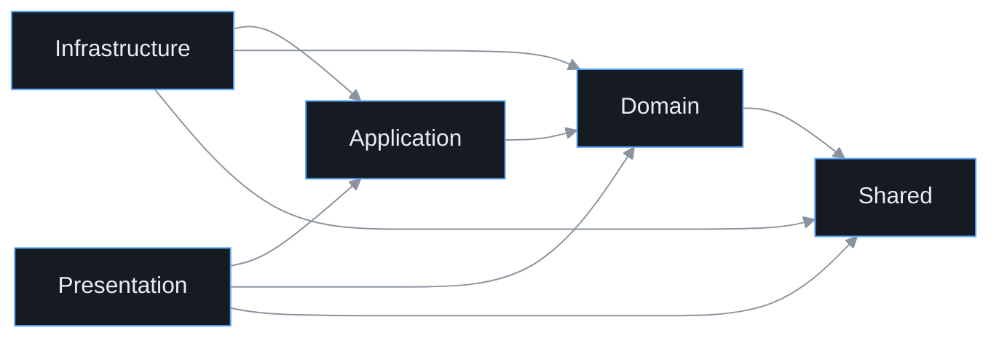

The diagram below shows the real classes behind each layer and the actual method calls for
both delivery paths:

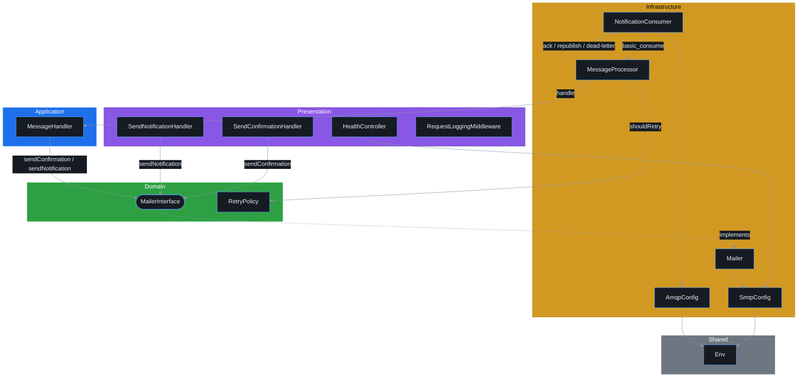

Two delivery mechanisms (HTTP and AMQP) both terminate at the same Domain port:

- **HTTP path:** `Handler\SendConfirmationHandler` / `Handler\SendNotificationHandler`
  (Presentation) call `MailerInterface` (Domain) directly — there is no separate Application
  class for this path since the "use case" is a one-line delegate after validation.
- **AMQP path:** `Consumer\NotificationConsumer` and `Consumer\MessageProcessor`
  (Infrastructure) handle the queue mechanics (connect, ack, retry, dead-letter) and delegate
  the transport-agnostic "interpret this message and call the mailer" step to
  `Consumer\MessageHandler` (Application), which depends only on `MailerInterface` (Domain).
- **Single adapter:** `Mailer` (Infrastructure) is `MailerInterface`'s only implementation —
  both paths reach PHPMailer/SMTP exclusively through it.

Full documentation: [../notification-service/docs/architecture/ARCHITECTURE.md](../notification-service/docs/architecture/ARCHITECTURE.md)

### Scanner Service

Scanner Service is a standalone PHP microservice, extracted from the release-notification
monolith via the Strangler Fig pattern, that polls GitHub for new releases on behalf of
confirmed subscribers and dispatches release notifications. It runs as a long-lived CLI
daemon (`bin/scanner.php`) rather than an HTTP service: on a fixed interval it fetches
confirmed subscriptions from the API service, checks each subscribed repository's latest
GitHub release, and — when a new tag appears — publishes a notification message to RabbitMQ
and records the new tag back on the subscription. The service owns no database; all state
(`subscriptions`) is owned by the API service and reached only through its internal HTTP
contract. The architecture is **ports & adapters (hexagonal), organised per feature** rather
than by top-level layer folders: each feature package (`GitHub`, `Notification`,
`Subscription`) declares the port interface it needs and ships one concrete adapter, and a
single use case (`Scanner\ReleaseScanner`) orchestrates them. Dependencies still point
inward — the use case depends only on ports and value objects, never on concrete adapters —
just expressed as regex layers over feature namespaces instead of `Domain/Application/...`
directories.

#### System Context (C4 L1)

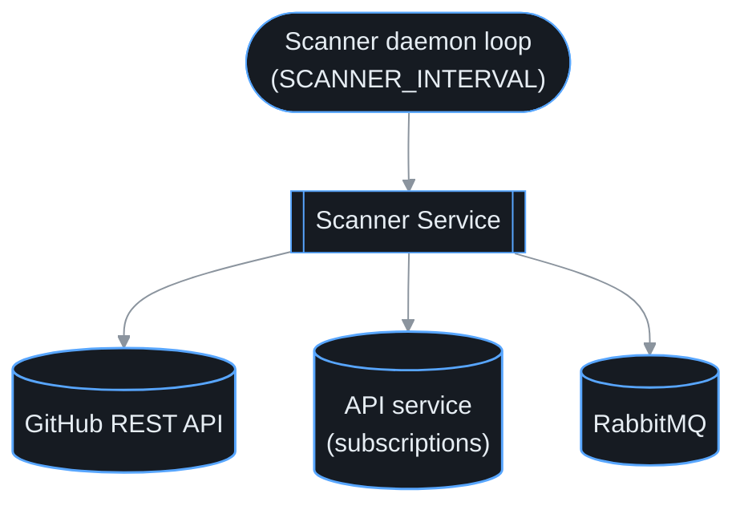

#### Containers (C4 L2)

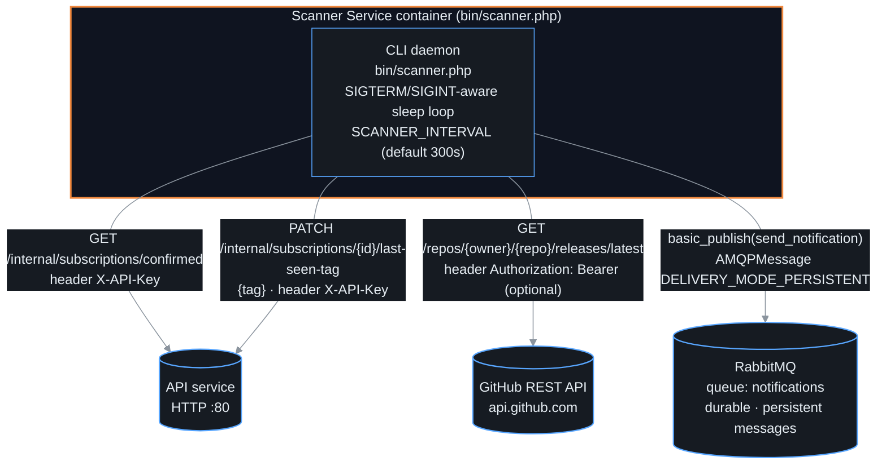

There is only one runtime container: the CLI daemon. It has no public HTTP surface, no
database, and no scheduler beyond its own sleep loop (`SCANNER_INTERVAL`, default 300s).
Both outbound HTTP calls (to the API service and to GitHub) are wrapped in a
`CircuitBreaker` instance so a degraded upstream trips open instead of blocking every cycle.

#### Components (C4 L3)

The Dependency Rule still applies — dependencies point inward toward ports and value
objects — but the layers are regex-matched across feature namespaces rather than physical
`Domain/`, `Application/`, `Infrastructure/` folders:

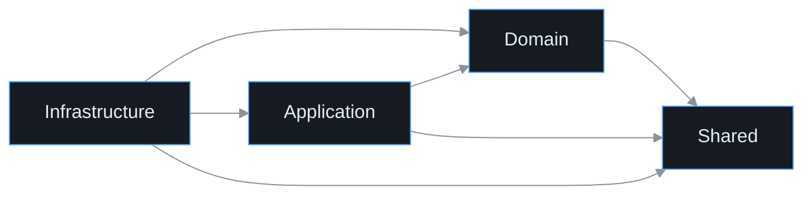

The diagram below shows the real classes behind each layer and the actual method calls
between them for one scan cycle:

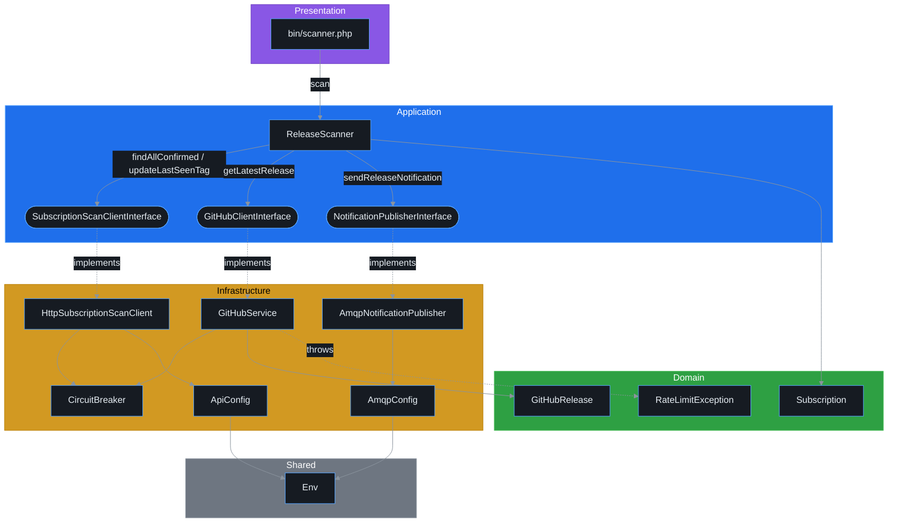

- **Domain** — value objects and domain exceptions belonging to a feature: `GitHub\GitHubRelease`
  (parses the GitHub API response into a tag name), `Subscription\Subscription` (read model of
  one confirmed subscription), `GitHub\Exception\RateLimitException` (carries the `Retry-After`
  seconds from a GitHub `429`).
- **Application** — the port interfaces each feature exposes (`SubscriptionScanClientInterface`,
  `GitHubClientInterface`, `NotificationPublisherInterface`), plus the one use case that
  orchestrates them, `Scanner\ReleaseScanner::scan()` / `processRepo()`.
- **Infrastructure** — concrete adapters (`HttpSubscriptionScanClient`, `GitHubService`,
  `AmqpNotificationPublisher`), the `CircuitBreaker` resilience wrapper both HTTP adapters call
  through (`HttpSubscriptionScanClient` reaches the API's `GET/PATCH /internal/subscriptions/*`,
  `GitHubService` reaches `GET /repos/{repo}/releases/latest` — see the Containers diagram
  above for the wire-level detail), and the typed config value objects (`ApiConfig`, `AmqpConfig`).
- **Shared** — `Config\Env`, the generic typed env-var reader used by every config object.
- **Presentation** — outside `src/`: `bin/scanner.php` is the composition root and CLI
  entry point; it builds the DI container (`config/container.php`) and drives the poll loop.

Full documentation: [../scanner-service/docs/architecture/ARCHITECTURE.md](../scanner-service/docs/architecture/ARCHITECTURE.md)

