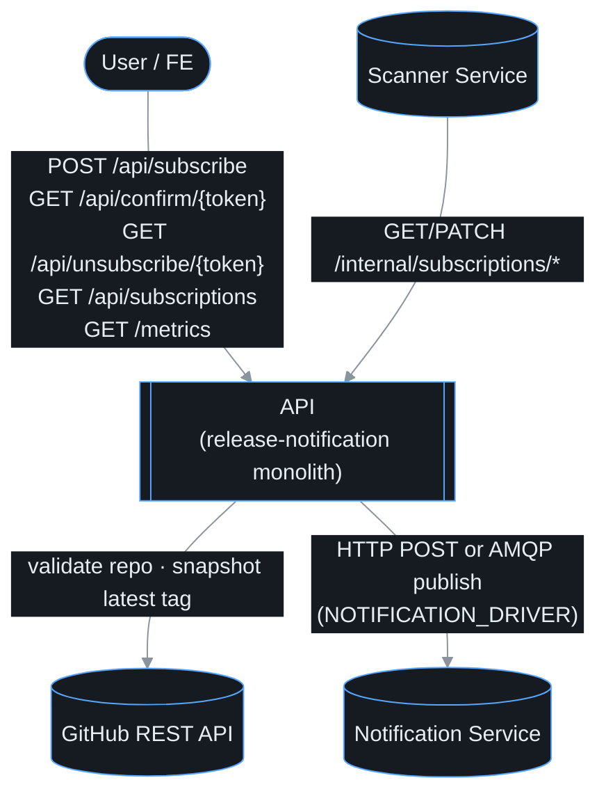
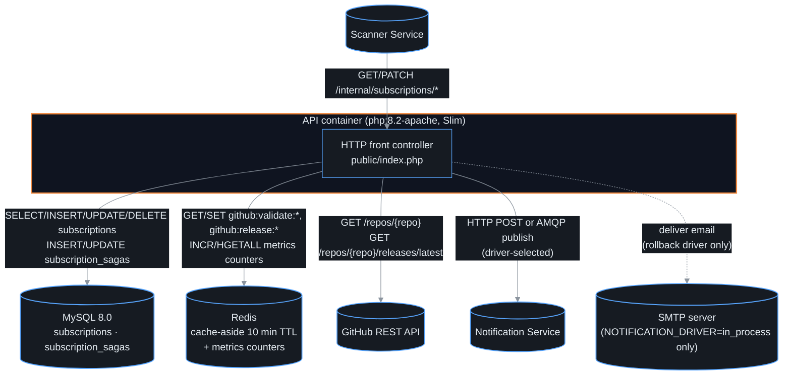
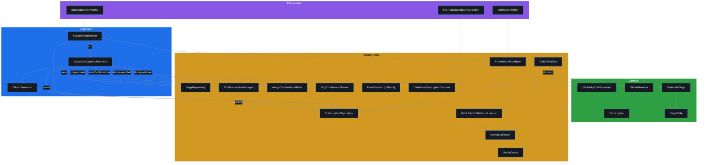
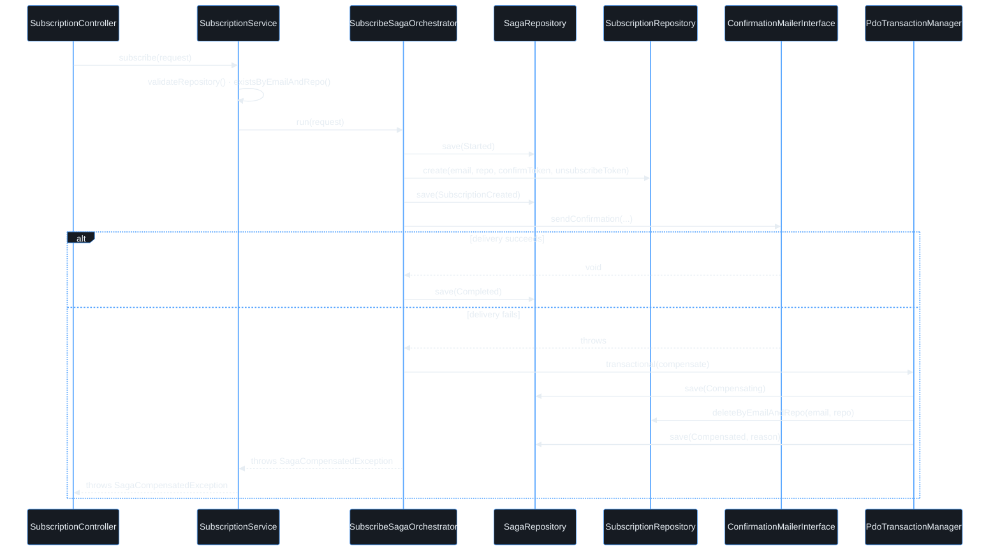

# Domain Map — GitHub Release Notification API

Generated: 2026-07-04
Branch: `hw-8-saga`

---

## 1. Overview

The API is the release-notification monolith: it owns subscription management end to end
(subscribe, confirm, unsubscribe, list) behind a saga that keeps the `subscriptions` table and
the confirmation email in sync without a distributed transaction, validates and snapshots
GitHub repository state via its own GitHub client, and exposes an internal HTTP contract that
Scanner Service reads and writes through instead of touching the database directly. Two
extracted services depend on it — Scanner Service calls its internal subscriptions endpoints,
and both the API and Scanner Service publish to Notification Service (directly over HTTP/AMQP,
or via the shared RabbitMQ queue). The one write path with a real failure mode — subscribe,
which must create a row *and* get an email out — is modelled explicitly as a **saga**
(`SubscribeSagaOrchestrator`) rather than hidden inside a single service method, so a mailer
failure compensates (deletes the row) instead of leaving an orphaned, unconfirmable
subscription.

## 2. System context (C4 L1)

## 3. Containers (C4 L2)

The API runs as a single container; there is no background process left in it — Scanner's
copy of the polling loop (`src/Modules/Scanner/`, root `bin/scanner.php`) is dead code, not
wired into `docker-compose.yml` (see § 7).

## 4. Components (C4 L3)

- **Presentation** — HTTP controllers: `SubscriptionController::subscribe()/confirm()/unsubscribe()/getSubscriptions()`,
  `InternalSubscriptionController::confirmed()/updateLastSeenTag()` (the only surface Scanner
  Service is allowed to call, behind `ApiKeyMiddleware` — database-per-service), and
  `MetricsController::metrics()`.
- **Application** — `SubscriptionService` is the façade the controller calls
  (`subscribe()/confirm()/unsubscribe()/getSubscriptions()`); it delegates the one multi-step
  write (subscribe) to `SubscribeSagaOrchestrator::run()`/`compensate()` and does everything
  single-step itself. `TokenGenerator::generate()` mints the confirm/unsubscribe tokens.
- **Domain** — `SubscribeSaga` is an immutable state machine (`SagaState`); each `withXxx()`
  call (`withSubscriptionCreated()`, `withCompleted()`, `withCompensating()`,
  `withCompensated()`) returns a new saga snapshot, persisted after every transition so the
  saga's progress survives a crash mid-run. `GitHubRelease::fromApiResponse()` and
  `GitHubApiCallRecorded` (endpoint, cacheHit) round out the domain layer.
- **Infrastructure** — `SubscriptionRepository` implements both the write-side and the
  Scanner-facing read/update ports (`existsByEmailAndRepo()`, `create()`, `confirm()`,
  `delete()`, `deleteByEmailAndRepo()`, `findAllConfirmed()`, `countActive()`);
  `ConfirmationMailerInterface` has three adapters selected by `NOTIFICATION_DRIVER`
  (`AmqpConfirmationMailer`, `HttpConfirmationMailer`, or the in-process `EmailService`
  fallback); GitHub API-call telemetry is decoupled from `GitHubService` via a domain event
  (`GitHubApiCallRecorded` → `GitHubApiCallMetricsListener`) rather than a direct call into
  Observability; `PdoTransactionManager::transactional()` wraps the saga's compensating delete.

## 5. Domain List

### Subscription
The core domain. Owns the full subscription lifecycle: create, confirm, unsubscribe, and query.

| | |
|---|---|
| **Owns** | `subscriptions` table, `subscription_sagas` table, `SubscriptionRepository`, `SagaRepository`, `SubscriptionService`, `SubscribeSagaOrchestrator`, `SubscriptionController`, `TokenGenerator`, `TransactionManagerInterface` / `PdoTransactionManager`, `SubscribeRequest` DTO, `Subscription` entity, `SubscribeSaga` / `SagaState` |
| **Reads** | GitHub API (via `GitHubServiceInterface`) — validates repo on subscribe, snapshots latest tag on confirm |
| **Writes** | Subscribe is a **saga**, not a single transaction: create the subscription row, then dispatch the confirmation email (via `ConfirmationMailerInterface`); a mailer failure compensates by deleting the row inside a DB transaction (`TransactionManagerInterface`) rather than leaving an unconfirmable orphan |
| **Emits** | (no event bus on the notification path) — calls `ConfirmationMailerInterface` directly from the saga |
| **Receives** | HTTP: `POST /api/subscribe`, `GET /api/confirm/{token}`, `GET /api/unsubscribe/{token}`, `GET /api/subscriptions` |
| **Exceptions** | `AlreadySubscribedException`, `TokenNotFoundException`, `ValidationException`, `SagaCompensatedException` |

---

### GitHub Integration
External API façade. Abstracts GitHub's REST API behind a stable domain interface. All callers consume `GitHubServiceInterface`.

| | |
|---|---|
| **Owns** | `GitHubService`, `GitHubServiceInterface`, `GitHubRelease` DTO, `GitHubReleaseUrlBuilder`, `ReleaseUrlBuilderInterface`, `GitHubApiCallRecorded` event |
| **Reads** | GitHub REST API (`/repos/{owner/repo}`, `/repos/{owner/repo}/releases/latest`); Redis cache via `CacheInterface` (10 min TTL) |
| **Writes** | Nothing — read-only; populates Redis cache as a side effect |
| **Emits** | `GitHubApiCallRecorded(endpoint, cacheHit)` on every call (consumed by Observability, decoupling cache-hit telemetry from the GitHub client); returns `?string` tag names or throws `InvalidRepositoryFormatException`, `RepositoryNotFoundException`, `RateLimitException` |
| **Receives** | Called by Subscription (validate + snapshot on confirm) |

---

### Notification (Strangler Fig — Phase 2, AMQP transport added)

Email delivery domain. Extracted to a standalone `notification-service` container in Phase 2. The monolith retains only domain interfaces and three transport adapters; the active transport is controlled by `NOTIFICATION_DRIVER`.

#### Monolith side (`src/Modules/Notification/`)

| Aspect | Detail |
|---|---|
| **Owns** | `ConfirmationMailerInterface`, `NotificationMailerInterface` (domain contracts) |
| **In-process impl** | `EmailService`, `EmailTemplates`, `SmtpConfig` — active when `NOTIFICATION_DRIVER=in_process` |
| **HTTP adapters** | `HttpConfirmationMailer`, `HttpNotificationMailer` — active when `NOTIFICATION_DRIVER=http`; POST to `notification-service` over Docker network |
| **AMQP adapters** | `AmqpConfirmationMailer`, `AmqpNotificationMailer`, `AmqpPublisher` — active when `NOTIFICATION_DRIVER=amqp`; publishes JSON to the `notifications` RabbitMQ queue |
| **Reads** | Nothing — all data passed as call parameters |
| **Writes** | Nothing — delegates to chosen transport impl |
| **Called by** | `SubscribeSagaOrchestrator` (confirmation email, step 2 of the saga) |

#### `notification-service/` (standalone container)

| | |
|---|---|
| **Owns** | `MailerInterface`, `Mailer`, `MessageHandler`, `NotificationConsumer`, `SendConfirmationHandler`, `SendNotificationHandler`, `HealthController`, `RequestLoggingMiddleware`, `SmtpConfig`, `AmqpConfig`, `Env` |
| **Reads** | HTTP POST body (when called via `http` driver) or AMQP message body (when `amqp` driver is active) |
| **Writes** | Sends SMTP email via PHPMailer |
| **Exposes** | `POST /send-confirmation`, `POST /send-notification`, `GET /health/live`, `GET /health/ready` |
| **Consumes** | `notifications` RabbitMQ queue — `send_confirmation` and `send_notification` message types |
| **Contract** | `notification-service/openapi.yaml` |
| **Rollback** | Set `NOTIFICATION_DRIVER=in_process` — instant, no redeploy |

---

### Scanner (Strangler Fig — extracted to `scanner-service`)

Long-running background process. Polls GitHub for new releases and dispatches notifications
to confirmed subscribers. Fully extracted to a standalone `scanner-service` container; the
monolith's copy is now dead code, not wired into any running container.

#### Monolith side (`src/Modules/Scanner/`) — dead code, not deployed

| Aspect | Detail |
|---|---|
| **Owns** | `ReleaseScanner`, `EchoLogger`, `MonologLogger`, `LoggerInterface`, root `bin/scanner.php` |
| **Status** | `docker-compose.yml`'s `scanner` service now builds `./scanner-service`, not the monolith image — this code and `bin/scanner.php` are unreferenced by any running container. `config/container.php` still binds `LoggerInterface`/`MonologLogger` for it. Slated for deletion once nothing depends on it (see Pain Point Inventory). |

#### `scanner-service/` (standalone container)

| | |
|---|---|
| **Owns** | `ReleaseScanner`, `GitHub\{GitHubService,GitHubClientInterface,GitHubRelease}`, `Notification\{AmqpNotificationPublisher,NotificationPublisherInterface}`, `Subscription\{HttpSubscriptionScanClient,SubscriptionScanClientInterface,Subscription}`, `Infrastructure\CircuitBreaker` |
| **Reads** | Confirmed subscriptions via `GET /internal/subscriptions/confirmed` on the API service (HTTP, `X-API-Key` auth) |
| **Reads** | Latest release tags directly from the GitHub REST API (its own HTTP client, not the monolith's `GitHubServiceInterface`) |
| **Writes** | `subscriptions.last_seen_tag` via `PATCH /internal/subscriptions/{id}/last-seen-tag` on the API service — no direct database access (database-per-service) |
| **Emits** | Publishes `send_notification` messages to the shared `notifications` RabbitMQ queue, consumed by Notification Service |
| **Receives** | Scheduled — `bin/scanner.php` (in `scanner-service/`) runs in a loop with configurable `SCANNER_INTERVAL` (default 300 s) |
| **Resilience** | Both the GitHub and API HTTP calls are wrapped in a `CircuitBreaker` |
| **Contract** | No OpenAPI yet — see [ADR-0001 in scanner-service](../../scanner-service/docs/architecture/decisions/0001-layered-architecture.md) for its internal architecture |

---

### Observability (Metrics)
Cross-cutting concern. Collects runtime counters in Redis and renders a Prometheus-compatible `/metrics` endpoint.

| | |
|---|---|
| **Owns** | `MetricsCollector`, `MetricsCollectorInterface`, `MetricsKeys`, `PrometheusRenderer`, `MetricsRendererInterface`, `NullMetricsCollector`, `DatabaseSubscriptionCounter`, `ActiveSubscriptionCounterInterface`, `MetricsMiddleware`, `MetricsController`, `GitHubApiCallMetricsListener` |
| **Reads** | Redis hash counters (HTTP requests, GitHub API calls, notification count, scanner cycles, latency histograms); `subscriptions` table `COUNT(*)` via `DatabaseSubscriptionCounter` |
| **Writes** | Redis counters only |
| **Emits** | Prometheus text format on `GET /metrics` |
| **Receives** | Incremented by `MetricsMiddleware` on every HTTP request, and by `GitHubApiCallMetricsListener` reacting to `GitHubApiCallRecorded` events from GitHub Integration |

---

### SharedKernel (cross-cutting infrastructure, not a domain)

Technical plumbing shared by all monolith modules. Contains no business logic.

| Namespace | Purpose |
|---|---|
| `SharedKernel/Infrastructure/Cache/` | `CacheInterface` + Redis implementation (`RedisCache`, `PredisAdapter`) + null stubs |
| `SharedKernel/Infrastructure/Database/` | `Connection` (PDO singleton factory), `Migrator` |
| `SharedKernel/Infrastructure/Event/` | `EventDispatcherInterface` / `SimpleEventDispatcher` — the in-process event bus `GitHubApiCallRecorded` travels over |
| `SharedKernel/Infrastructure/` | `Env` (typed env-var reader), `Json` (encode/decode with exceptions) |
| `SharedKernel/Domain/` | `HttpExceptionInterface`, `DomainEvent` |
| `Bootstrap/Middleware/` | `ApiKeyMiddleware`, `CorsMiddleware`, `LoggingMiddleware` |

## 6. Key runtime flows

**Subscribe saga** (`SubscribeSagaOrchestrator::run()`), the one write path with a real
compensating action:

Every saga transition is persisted to `subscription_sagas` before the next step runs, so a
crash mid-saga leaves a resumable, inspectable record rather than a silently half-done write —
there is no reconciliation job yet that resumes an interrupted saga automatically (see Pain
Point Inventory).

**Confirm** (`SubscriptionService::confirm()`): looks up the subscription by
`confirm_token`, is a no-op if already confirmed, snapshots the repo's current latest tag via
`GitHubServiceInterface::getLatestRelease()` (cache-aside, 10 min TTL), and
`UPDATE`s `confirmed = 1, last_seen_tag = ?`. That snapshot is what Scanner Service diffs
against on its next poll — the confirm step, not the saga, is what makes the subscriber
"caught up as of now" instead of getting notified about every release that predates them.

**Internal contract** (`InternalSubscriptionController`, called only by Scanner Service):
`GET /internal/subscriptions/confirmed` returns every confirmed row;
`PATCH /internal/subscriptions/{id}/last-seen-tag` updates one row's `last_seen_tag` after a
notification is sent. Both are protected by `ApiKeyMiddleware` and are the *only* way another
service touches subscription state (database-per-service).

### Transport selection (NOTIFICATION_DRIVER)

| Value | Transport | Trade-off |
|---|---|---|
| `amqp` | RabbitMQ queue → `notification-service` consumer | Fully async; SMTP failures don't block the saga's mailer step; retry via nack |
| `http` | Synchronous HTTP POST → `notification-service` | Simpler; a failure surfaces immediately and triggers the saga's compensation |
| `in_process` | Direct PHP call to `EmailService` | Zero-dependency rollback; no network hop; a failure still triggers compensation |

---

## 7. Pain Point Inventory

| File / Class | Issue | Status |
|---|---|---|
| No automatic saga resumption | If the process crashes between `SubscriptionCreated` and either `Completed` or `Compensated`, the saga sits in `subscription_sagas` in that state forever — nothing polls for and resumes/compensates stuck sagas. | Open — acceptable for now given low write volume, but the first thing to add if this becomes multi-instance |
| `DatabaseSubscriptionCounter` in `Observability/` | Reaches into the `subscriptions` table from a different namespace. Fine as a read-only query; would require an anti-corruption layer if databases are ever split. | Open (low severity) |
| Dead code: `src/Modules/Scanner/`, root `bin/scanner.php`, the `Scanner\*` bindings in `config/container.php` | Left over from before extraction. `docker-compose.yml`'s `scanner` service now builds `./scanner-service`, so none of this runs anywhere. | Open — safe to delete; nothing depends on it |
| Shared `subscriptions` table | Was written to by both the API process and the in-monolith scanner process. Now that Scanner is `scanner-service`, all writes go through `InternalSubscriptionController` (HTTP) — the table itself is API-owned only. | **Addressed** by the Scanner extraction (database-per-service now holds for Scanner) |
| `EmailTemplates` / `SmtpConfig` duplicated | Monolith retains them for the in-process fallback; `notification-service` has its own equivalents. | Resolves in Phase 3 when the in-process code is deleted |
| No dead-letter queue for AMQP (monolith side) | The monolith only *publishes*; `notification-service`'s `MessageProcessor` + `RetryPolicy` handle retry/dead-lettering on the consuming side. | **Addressed** on the consumer; nothing to do on the publisher |

---

## 8. Assessment

**Strangler Fig — Notification Phase 2 complete (AMQP added); Scanner extraction complete; Subscribe rewritten as a saga.**

The Notification domain has been fully extracted into a standalone `notification-service` container, with AMQP added as a third transport alongside synchronous HTTP and the in-process fallback. The monolith domain interfaces (`ConfirmationMailerInterface`, `NotificationMailerInterface`) are unchanged; callers are transport-agnostic.

The Scanner domain, previously the primary remaining structural tension (shared write access to the `subscriptions` table), has since been extracted into its own `scanner-service` container. It never touches the API's database directly — it reads and updates subscriptions only through `InternalSubscriptionController`'s HTTP contract (`GET /internal/subscriptions/confirmed`, `PATCH /internal/subscriptions/{id}/last-seen-tag`), and it polls GitHub with its own client rather than the monolith's `GitHubServiceInterface`. Database-per-service now holds for all three domains that have been extracted.

The subscribe flow — the one path that writes to the database *and* has to get an email out — is now an explicit saga (`SubscribeSagaOrchestrator`) instead of a single service method that would otherwise leave an orphaned, unconfirmable row if the mailer call failed partway through. Every transition (`Started → SubscriptionCreated → Completed`, or `→ Compensating → Compensated`) is persisted to `subscription_sagas` before proceeding, and compensation (deleting the row) runs inside a real DB transaction (`PdoTransactionManager`). This is a local, single-process saga (no separate saga-coordinator service or event bus) — appropriate at the current scale, but see the Pain Point Inventory for the one gap (no automatic resumption of a saga stuck mid-flight after a crash).

The remaining monolith structure (`Subscription`, `GitHub`, `Observability`, `Notification`) is well-modularised, each following a clean `Domain / Application / Infrastructure` layer pattern. The `SharedKernel` holds technical plumbing with no domain logic, including the transaction manager and the small in-process event bus that decouples GitHub API-call telemetry from the GitHub client itself. No god classes exist. The one open item is dead code: the monolith's copy of Scanner (`src/Modules/Scanner/`, root `bin/scanner.php`) is no longer wired into any running container and should be deleted.

---

## 9. Recommended Next Step

**Option A — Phase 3 cutover (Notification):** After 2+ weeks of AMQP stability in production:

1. Promote `NOTIFICATION_DRIVER=amqp` as the hardcoded default
2. Delete `EmailService`, `EmailTemplates`, `SmtpConfig` from the monolith, and the `HttpConfirmationMailer`/`HttpNotificationMailer` HTTP adapters
3. Remove the `NOTIFICATION_DRIVER` toggle from `config/container.php` and `.env.example`

**Option B — Delete the dead Scanner code:** Now that `scanner-service` is the only Scanner
that actually runs, remove `src/Modules/Scanner/`, root `bin/scanner.php`, and the
corresponding `LoggerInterface`/`MonologLogger` bindings in `config/container.php`. Low risk —
nothing in `docker-compose.yml` builds or runs this code anymore.

**Option C — Saga resumption:** Add a scheduled job that scans `subscription_sagas` for rows
stuck in `Started` or `SubscriptionCreated` past a timeout and either retries the mailer step
or forces compensation — closes the one gap noted in the Pain Point Inventory. Only worth it
once there's more than one API instance or meaningfully non-zero saga failure volume.

See [ADR-003](../adr/0003-extract-notification-as-microservice.md) for the Notification extraction rationale and rollback plan.
