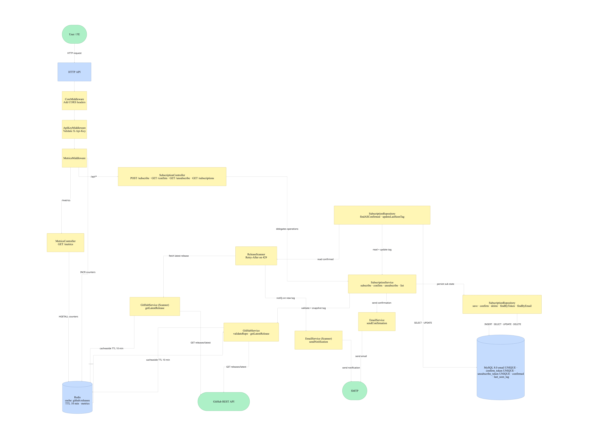

# System Design — Release Notification API

## Overview

A monolithic PHP service that lets users subscribe to GitHub repository release notifications via email. Two runtime processes share a MySQL database and Redis instance: an HTTP API for subscription management, and a background scanner that polls GitHub every 5 minutes and emails subscribers when a new release is detected.

## Architecture



The system runs fully in Docker Compose. The HTTP API and Scanner containers share MySQL (persistence) and Redis (cache + metrics). GitHub REST API is the only external dependency.

## Components

**HTTP API** (`php:8.2-apache`)

| Component | Responsibility |
|---|---|
| Middleware | CORS, API key auth, request metrics recording |
| SubscriptionController | Parses requests, maps domain exceptions to HTTP codes |
| MetricsController | Renders Prometheus-format counters from Redis |
| SubscriptionService | Orchestrates subscribe / confirm / unsubscribe / list |
| GitHubService | Validates repos and fetches latest release tags; cache-aside with 10 min TTL |
| EmailService | Sends confirmation and notification emails via SMTP (PHPMailer) |
| SubscriptionRepository | CRUD on the `subscriptions` table via PDO |

**Scanner** (background process)

Infinite loop that reads all confirmed subscriptions, checks the latest GitHub release (cache-aside), and sends an email when a new tag is detected. Handles GitHub `429` responses via the `Retry-After` header.

## Subscription Lifecycle

```text
POST /api/subscribe
  → validate email + repo (GitHub API)
  → INSERT subscription (confirmed=0)
  → send confirmation email

GET /api/confirm/{token}
  → snapshot current latest release tag
  → UPDATE confirmed=1, last_seen_tag=tag

[Scanner — every 5 min]
  → for each confirmed subscription:
      fetch latest tag (cached)
      if tag != last_seen_tag → email user + UPDATE last_seen_tag

GET /api/unsubscribe/{token}
  → DELETE subscription
```

## Data Model

Single table: `subscriptions`

| Column | Notes |
|---|---|
| `email`, `repo` | Unique together |
| `confirmed` | 0 = pending, 1 = active |
| `confirm_token`, `unsubscribe_token` | 32-byte random hex, each unique |
| `last_seen_tag` | Latest tag at confirmation time; updated on each notification |

## Key Design Decisions

| Decision | ADR |
|---|---|
| Redis for caching and metrics | [ADR-001](adr/0001-redis-for-caching-and-metrics.md) |
| MySQL as the primary datastore | [ADR-002](adr/0002-mysql-as-primary-datastore.md) |

## Known Limitations

- Email is sent synchronously in the request path — an SMTP outage blocks the subscribe response
- Failed scanner notification emails are not retried — a missed send is silently skipped
- Single Redis node — a crash resets all metrics counters and forces cold GitHub API cache
