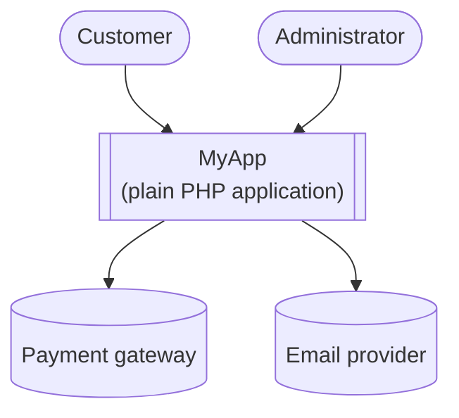
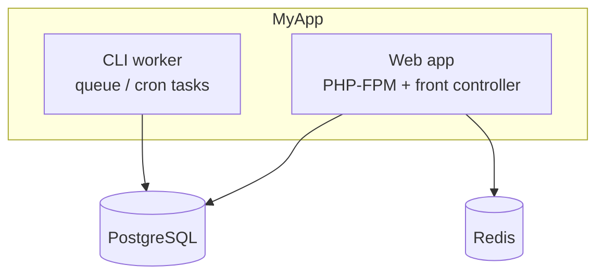
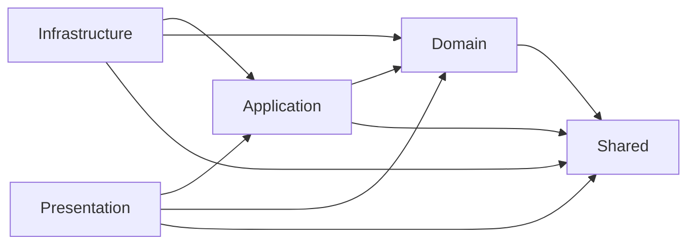

# C4 diagrams & ADRs reference

How to draw the architecture with the C4 model using Mermaid, and how to write Architecture
Decision Records. Mermaid is preferred because it renders on GitHub and most Markdown
viewers with no build step.

## C4 model — the levels you actually need

The C4 model has four levels; for most applications the first three are enough.

1. **System Context** — the system as a single box, its human users, and the external
   systems it talks to. Answers "what is this and who/what does it interact with?"
2. **Container** — the separately runnable/deployable things: the web app, a CLI worker,
   the database, a cache, external APIs. Answers "what are the moving parts and how do they
   communicate?" (Here "container" means a runtime process/datastore, not Docker.)
3. **Component** — inside one container, the major structural pieces. For this project that
   is the **layers** and the inward direction of their dependencies.
4. **Code** — class-level detail. Usually skip; the code itself and the dependency tests
   are the source of truth at this level.

### Mermaid snippets to adapt

**System context**

**Container**

**Component — layers and the Dependency Rule.** Arrows show the direction source-code
dependencies point: inward, toward the Domain.

Tips:
- Every arrow means "depends on / uses". Keep them pointing the way the code actually
  depends, so the diagram doubles as a specification the tests check.
- Label external systems and datastores distinctly (rounded/cylinder shapes) so readers can
  see the trust/technology boundary at a glance.

## Architecture Decision Records (ADRs)

An ADR captures one architecturally significant decision, the context that forced it, and
the consequences. They are the project's memory: they stop teams from re-litigating settled
questions and explain to newcomers *why* the code looks the way it does.

Rules of thumb:
- **One decision per record.** Numbered sequentially (`0001`, `0002`, …).
- **Immutable once accepted.** Don't rewrite history — if a decision changes, write a new
  ADR with status `Accepted` that marks the old one `Superseded by 00NN`.
- **Explain the alternatives you rejected** and why. A decision with no considered
  alternatives usually wasn't a decision.
- **Keep it short** — context, decision, consequences (good and bad). A page is plenty.

Use `assets/adr-0000-template.md`. Write **ADR-0001** first to record the layered
architecture and the Dependency Rule; that single record justifies the whole enforced-tests
setup.

## Sources

- **C4 model for software architecture** — Simon Brown, https://c4model.com
- **Documenting Architecture Decisions** (the ADR format) — Michael Nygard.
- **Mermaid** diagram syntax — https://mermaid.js.org
