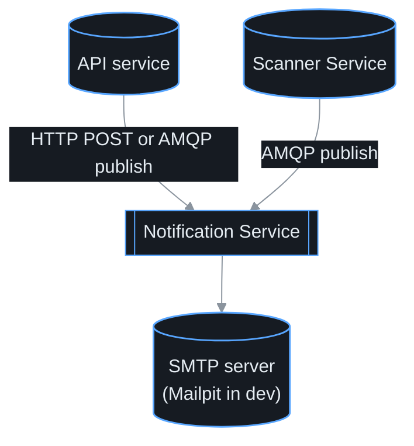
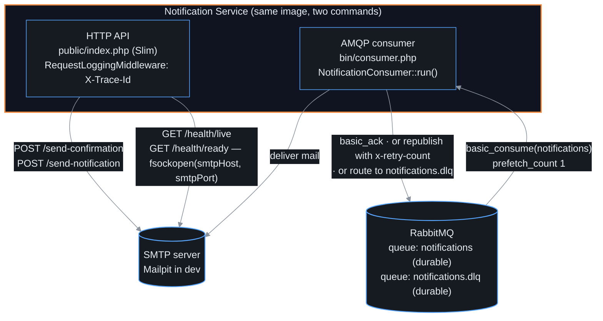
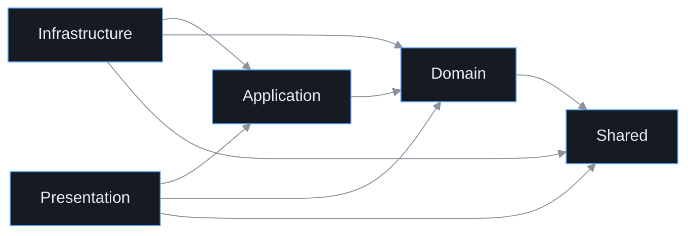
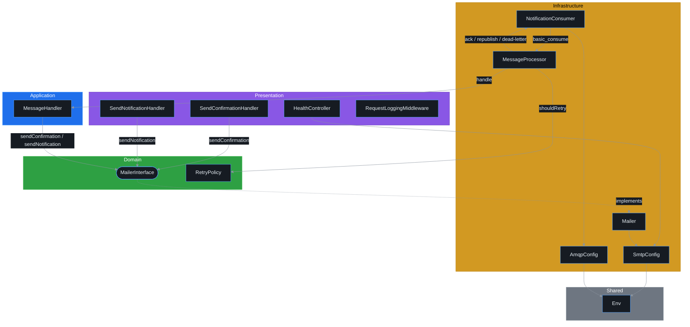
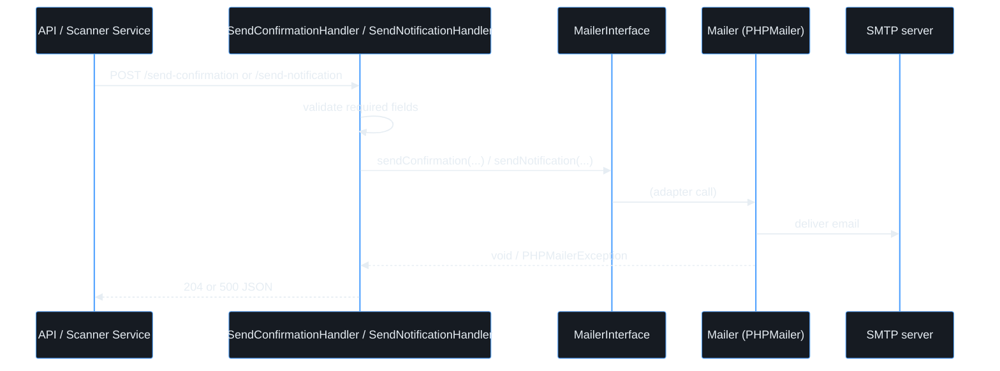
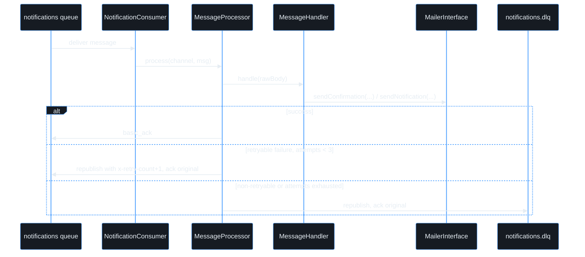

# Architecture

## 1. Overview

Notification Service is a standalone PHP microservice, extracted from the release-notification
monolith via the Strangler Fig pattern, that owns email delivery: confirmation emails and
release-notification emails. It exposes two independently deployable entry points built from
the same image — an HTTP API (`public/index.php`, Slim) for the synchronous path
(`NOTIFICATION_DRIVER=http`) and a CLI AMQP consumer (`bin/consumer.php`) for the asynchronous
path (`NOTIFICATION_DRIVER=amqp`), both driving the same underlying capability. The service
owns no database and no state; its only outward dependency is an SMTP server. The
architecture is **ports & adapters organised per feature**, not top-level layer folders: the
single `MailerInterface` port is the one thing both delivery mechanisms depend on, and
`Mailer` (PHPMailer-backed) is its only adapter. Dependencies still point inward — both
delivery paths reach the mailer only through the port, and the AMQP path's reliability
plumbing (retry, dead-lettering) is kept out of the HTTP path entirely.

## 2. System context (C4 L1)

## 3. Containers (C4 L2)

`notification` and `notification-consumer` are two containers built from the same image
(`docker-compose.yml`) running different commands — the HTTP process never touches RabbitMQ,
and the consumer process never binds a port.

## 4. Components — layers (C4 L3)

The diagram below shows the real classes behind each layer and the actual method calls for
both delivery paths:

Two delivery mechanisms (HTTP and AMQP) both terminate at the same Domain port:

- **HTTP path:** `Handler\SendConfirmationHandler` / `Handler\SendNotificationHandler`
  (Presentation) call `MailerInterface` (Domain) directly — there is no separate Application
  class for this path since the "use case" is a one-line delegate after validation.
- **AMQP path:** `Consumer\NotificationConsumer` and `Consumer\MessageProcessor`
  (Infrastructure) handle the queue mechanics (connect, ack, retry, dead-letter) and delegate
  the transport-agnostic "interpret this message and call the mailer" step to
  `Consumer\MessageHandler` (Application), which depends only on `MailerInterface` (Domain).
- **Single adapter:** `Mailer` (Infrastructure) is `MailerInterface`'s only implementation —
  both paths reach PHPMailer/SMTP exclusively through it.

## 5. Layer breakdown

The **Dependency Rule**: source-code dependencies point inward. This table is the contract;
it is enforced by the dependency tests (`composer arch`).

| Layer | Namespace pattern | Responsibility | Representative classes | May depend on | Must never depend on |
| --- | --- | --- | --- | --- | --- |
| Domain | `NotificationService\MailerInterface`, `NotificationService\Consumer\RetryPolicy` | The mailer port and the one business rule (how many attempts, which failures are retryable) | `MailerInterface`, `Consumer\RetryPolicy` | `Shared` | Application, Infrastructure, Presentation |
| Application | `NotificationService\Consumer\MessageHandler` | The transport-agnostic use case: parse an inbound message, validate it, call the port | `Consumer\MessageHandler` | Domain, Shared | Infrastructure, Presentation |
| Infrastructure | `NotificationService\Mailer`, `NotificationService\Consumer\{MessageProcessor,NotificationConsumer}`, `NotificationService\Config\{SmtpConfig,AmqpConfig}`, `PhpAmqpLib\*`, `PHPMailer\PHPMailer\PHPMailer` | The SMTP adapter and the AMQP queue mechanics (connect, ack, retry, dead-letter) | `Mailer`, `Consumer\MessageProcessor`, `Consumer\NotificationConsumer` | Application, Domain, Shared | Presentation |
| Presentation | `NotificationService\Handler\*`, `NotificationService\Health\HealthController`, `NotificationService\Middleware\RequestLoggingMiddleware`, `Psr\Http\{Message,Server}\*` | HTTP request/response mapping: the two send-mail routes, health checks, trace-id logging | `Handler\SendConfirmationHandler`, `Handler\SendNotificationHandler`, `Health\HealthController` | Application, Domain, Shared | Infrastructure |
| Shared | `NotificationService\Config\Env`, `Psr\Log\*`, `PHPMailer\PHPMailer\Exception` | Tiny cross-cutting kernel: the env reader, the logging contract, and the checked exception the port itself declares | `Config\Env` | — | everything internal |

> `PHPMailer\PHPMailer\Exception` sits in Shared rather than Infrastructure because
> `MailerInterface` declares `@throws PHPMailerException` on both methods — it is part of
> the port's own contract, so Presentation and Application callers legitimately catch it. This
> is a known, minor abstraction leak (see ADR-0001) rather than an accident: fully hiding it
> would mean introducing a domain-specific `MailerException` wrapper, which isn't worth the
> ceremony for a service with a single adapter.

## 6. Key runtime flows

**HTTP path** (`NOTIFICATION_DRIVER=http`):

**AMQP path** (`NOTIFICATION_DRIVER=amqp`), with retry and dead-lettering:

`RetryPolicy` (Domain) decides retryability: `\InvalidArgumentException` and `\JsonException`
(malformed input) go straight to the dead-letter queue since retrying won't fix them;
everything else gets up to 3 attempts before landing there.

## 7. Cross-cutting concerns

- **Two composition roots** — `public/index.php` wires the Slim app and HTTP middleware;
  `bin/consumer.php` wires the AMQP consumer loop. Both build the same PHP-DI container from
  `config/container.php`, the only place `MailerInterface` is bound to `Mailer`.
- **Configuration** — `Config\Env` reads typed env vars; `Config\SmtpConfig` /
  `Config\AmqpConfig` are immutable settings value objects built once at the composition root.
- **Logging** — a Monolog JSON logger (stderr by default) is injected via
  `Psr\Log\LoggerInterface`. `Middleware\RequestLoggingMiddleware` stamps every HTTP
  request/response with an `X-Trace-Id` (generated if the caller didn't send one) so traces
  span both services in the ELK stack; the consumer path logs the same way per message.
- **Reliability (AMQP only)** — `MessageProcessor` acks on success, republishes with an
  incremented `x-retry-count` header on a retryable failure, and routes to
  `notifications.dlq` once `RetryPolicy` says to stop retrying. The HTTP path has no
  equivalent — a failed send there is just a 500 back to the caller.
- **Graceful shutdown** — `NotificationConsumer` traps `SIGTERM` and stops consuming cleanly
  instead of dropping an in-flight message.
- **Health checks** — `GET /health/live` is a liveness no-op; `GET /health/ready` probes SMTP
  reachability with a raw socket connect, since that's the service's only real dependency.
- **No database** — this service owns no schema; it is stateless apart from the SMTP
  round-trip.

## 8. How the architecture is enforced

The layers above are checked automatically:

- **Deptrac** verifies layer boundaries (`deptrac.yaml`).
- **PHPArkitect** verifies finer rules — naming and "depends only on" (`phparkitect.php`).

Run locally with `composer arch`; CI (`.github/workflows/architecture.yml`) runs the same
checks on every push and pull request.

## 9. Decision records

Architectural decisions are recorded as ADRs in [`decisions/`](decisions/).

- [ADR-0001 — Ports & adapters per feature, enforced by the Dependency Rule](decisions/0001-layered-architecture.md)
