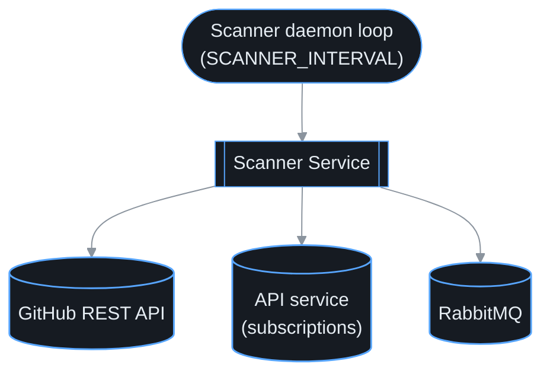
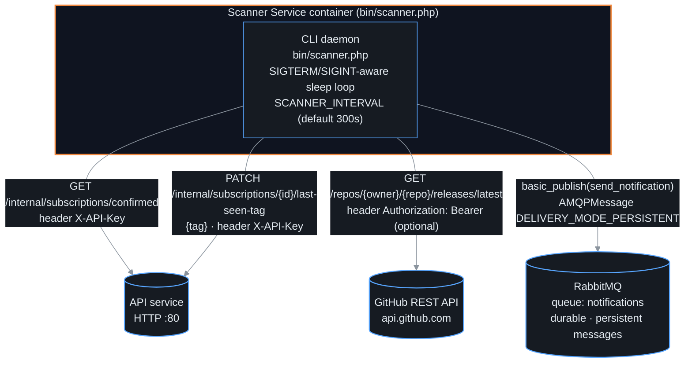
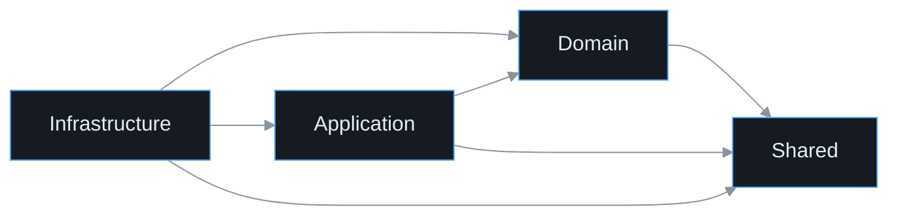
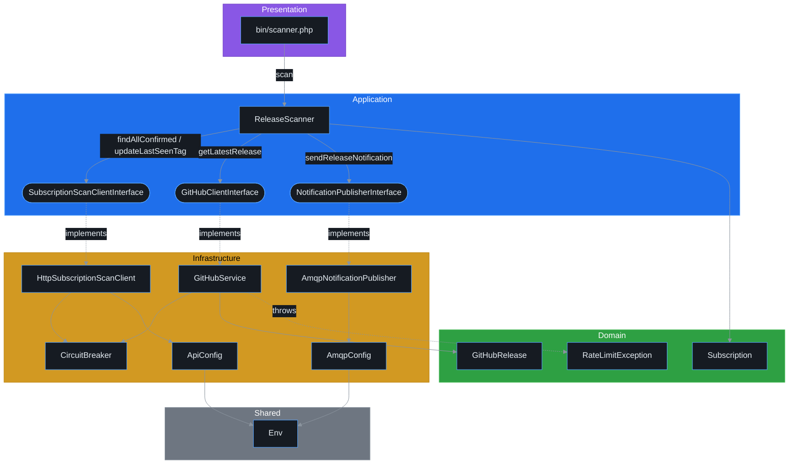
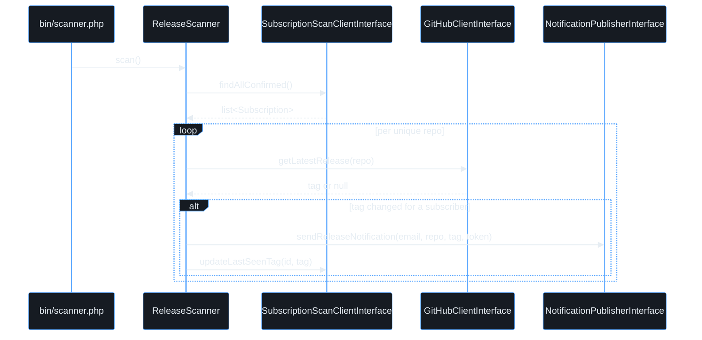

# Architecture

## 1. Overview

Scanner Service is a standalone PHP microservice, extracted from the release-notification
monolith via the Strangler Fig pattern, that polls GitHub for new releases on behalf of
confirmed subscribers and dispatches release notifications. It runs as a long-lived CLI
daemon (`bin/scanner.php`) rather than an HTTP service: on a fixed interval it fetches
confirmed subscriptions from the API service, checks each subscribed repository's latest
GitHub release, and — when a new tag appears — publishes a notification message to RabbitMQ
and records the new tag back on the subscription. The service owns no database; all state
(`subscriptions`) is owned by the API service and reached only through its internal HTTP
contract. The architecture is **ports & adapters (hexagonal), organised per feature** rather
than by top-level layer folders: each feature package (`GitHub`, `Notification`,
`Subscription`) declares the port interface it needs and ships one concrete adapter, and a
single use case (`Scanner\ReleaseScanner`) orchestrates them. Dependencies still point
inward — the use case depends only on ports and value objects, never on concrete adapters —
just expressed as regex layers over feature namespaces instead of `Domain/Application/...`
directories.

## 2. System context (C4 L1)

## 3. Containers (C4 L2)

There is only one runtime container: the CLI daemon. It has no public HTTP surface, no
database, and no scheduler beyond its own sleep loop (`SCANNER_INTERVAL`, default 300s).
Both outbound HTTP calls (to the API service and to GitHub) are wrapped in a
`CircuitBreaker` instance so a degraded upstream trips open instead of blocking every cycle.

## 4. Components — layers (C4 L3)

The Dependency Rule still applies — dependencies point inward toward ports and value
objects — but the layers are regex-matched across feature namespaces rather than physical
`Domain/`, `Application/`, `Infrastructure/` folders:

The diagram below shows the real classes behind each layer and the actual method calls
between them for one scan cycle:

- **Domain** — value objects and domain exceptions belonging to a feature: `GitHub\GitHubRelease`
  (parses the GitHub API response into a tag name), `Subscription\Subscription` (read model of
  one confirmed subscription), `GitHub\Exception\RateLimitException` (carries the `Retry-After`
  seconds from a GitHub `429`).
- **Application** — the port interfaces each feature exposes (`SubscriptionScanClientInterface`,
  `GitHubClientInterface`, `NotificationPublisherInterface`), plus the one use case that
  orchestrates them, `Scanner\ReleaseScanner::scan()` / `processRepo()`.
- **Infrastructure** — concrete adapters (`HttpSubscriptionScanClient`, `GitHubService`,
  `AmqpNotificationPublisher`), the `CircuitBreaker` resilience wrapper both HTTP adapters call
  through (`HttpSubscriptionScanClient` reaches the API's `GET/PATCH /internal/subscriptions/*`,
  `GitHubService` reaches `GET /repos/{repo}/releases/latest` — see the Containers diagram
  above for the wire-level detail), and the typed config value objects (`ApiConfig`, `AmqpConfig`).
- **Shared** — `Config\Env`, the generic typed env-var reader used by every config object.
- **Presentation** — outside `src/`: `bin/scanner.php` is the composition root and CLI
  entry point; it builds the DI container (`config/container.php`) and drives the poll loop.

## 5. Layer breakdown

The **Dependency Rule**: source-code dependencies point inward. This table is the contract;
it is enforced by the dependency tests (`composer arch`).

| Layer | Namespace pattern | Responsibility | Representative classes | May depend on | Must never depend on |
| --- | --- | --- | --- | --- | --- |
| Domain | `ScannerService\{Feature}` value objects & exceptions | Business data and rules with no outward dependencies | `GitHub\GitHubRelease`, `GitHub\Exception\RateLimitException`, `Subscription\Subscription` | `Shared` | Application, Infrastructure, Presentation |
| Application | `ScannerService\*Interface` (ports) + `ScannerService\Scanner\ReleaseScanner` (use case) | The one use case (poll → compare → notify) and the ports it needs from the outside world | `GitHubClientInterface`, `SubscriptionScanClientInterface`, `NotificationPublisherInterface`, `Scanner\ReleaseScanner` | Domain, Shared | Infrastructure, Presentation |
| Infrastructure | `ScannerService\{Feature}` adapters, `ScannerService\Infrastructure\*`, `ScannerService\Config\{AmqpConfig,ApiConfig}`, `GuzzleHttp\*`, `PhpAmqpLib\*` | Adapters implementing the ports, plus resilience, typed settings, and the transport libraries they wrap | `GitHub\GitHubService`, `Subscription\HttpSubscriptionScanClient`, `Notification\AmqpNotificationPublisher`, `Infrastructure\CircuitBreaker` | Application, Domain, Shared | Presentation |
| Shared | `ScannerService\Config\Env`, `Psr\Log\*` | Tiny cross-cutting kernel — typed env-var reads and the logging contract every layer may use | `Config\Env`, `Psr\Log\LoggerInterface` | — | everything internal |
| Presentation | `bin/scanner.php` (outside `src/`, not deptrac-covered) | CLI entry point / composition root: builds the container, runs the signal-aware poll loop | `bin/scanner.php`, `config/container.php` | Application, Domain, Shared | Infrastructure directly (only via the container) |

## 6. Key runtime flows

**Scan cycle** (`ReleaseScanner::scan()`, driven every `SCANNER_INTERVAL` seconds):

`SubscriptionScanClientInterface` is implemented by `HttpSubscriptionScanClient`, which calls
the API service's internal contract (`GET /internal/subscriptions/confirmed`,
`PATCH /internal/subscriptions/{id}/last-seen-tag`) — the API's database is never touched
directly (database-per-service, ADR-0002 at the platform level).

`NotificationPublisherInterface` is implemented by `AmqpNotificationPublisher`, which
publishes a `send_notification` message to the shared `notifications` RabbitMQ queue that
Notification Service consumes — the two services never call each other's code directly.

**Resilience:** both the GitHub and API HTTP calls are wrapped in a `CircuitBreaker`
(`circuit_breaker.github`, `circuit_breaker.subscription` in `config/container.php`) so a
degraded upstream trips open instead of blocking every scan cycle; a GitHub 429 is turned
into a typed `RateLimitException` that the use case handles by sleeping the given
`Retry-After` and continuing with the next repo.

## 7. Cross-cutting concerns

- **Configuration** — `Config\Env` reads typed env vars; `Config\ApiConfig` / `Config\AmqpConfig`
  are immutable settings value objects built once in `config/container.php`.
- **Composition root** — `config/container.php` (PHP-DI) is the only place a port interface
  is bound to its concrete adapter (`GitHubClientInterface` → `GitHubService`, etc.);
  `bin/scanner.php` never instantiates an adapter itself.
- **Logging** — a Monolog JSON logger (stderr by default) is injected via `Psr\Log\LoggerInterface`;
  every scan cycle, rate-limit, and delivery outcome is logged structuredly.
- **Error handling** — `ReleaseScanner` catches per-repo failures so one bad repo/subscriber
  doesn't abort the cycle; the daemon itself catches `\Throwable` around each `scan()` call
  and keeps looping.
- **Process lifecycle** — `bin/scanner.php` traps `SIGTERM`/`SIGINT` to finish the current
  sleep/scan cleanly before exiting (graceful shutdown under Docker/Kubernetes).
- **No database** — this service owns no schema; all subscription state lives in the API
  service and is reached only via its internal HTTP contract (database-per-service).

## 8. How the architecture is enforced

The layers above are checked automatically:

- **Deptrac** verifies layer boundaries (`deptrac.yaml`).
- **PHPArkitect** verifies finer rules — naming and "depends only on" (`phparkitect.php`).

Run locally with `composer arch`; CI (`.github/workflows/architecture.yml`) runs the same
checks on every push and pull request.

## 9. Decision records

Architectural decisions are recorded as ADRs in [`decisions/`](decisions/).

- [ADR-0001 — Ports & adapters per feature, enforced by the Dependency Rule](decisions/0001-layered-architecture.md)
